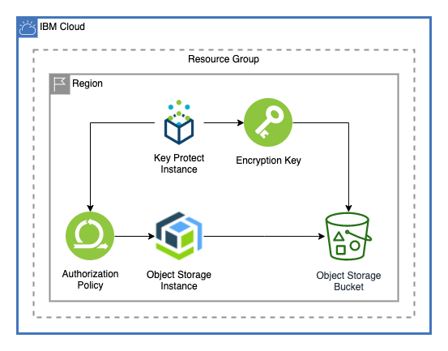

# KMS Encrypted Cross Region COS Bucket

This module shows how to create a COS bucket encrypted with a KMS key.

---

## Table of Contents

1. [Setup](##Setup)
2. [Resources](##Resources)

---

## Setup

This module requires an existing [Cloud Object Storage](https://www.ibm.com/cloud/object-storage) and [Key Protect](https://www.ibm.com/cloud/key-protect) instance.

---

## Resources

This module creates three resources, an IAM Authorization Policy, a Key Protect Encryption Key, and a COS Bucket

### Authorization Policy

This creates an authorization policy to allow the COS instance to read keys from the Key Protect instance so that the bucket can be encrypted.

### Key Protect Key

This creates a key to encrypt the COS bucket. You can bring your own key or have one created for you.

### COS Bucket

This creates a COS Bucket with the created key

---

## Module Variables

Variable              | Type   | Description                                                                                                                                                                                                                                                                                                                                                                                          | Default
--------------------- | ------ | ---------------------------------------------------------------------------------------------------------------------------------------------------------------------------------------------------------------------------------------------------------------------------------------------------------------------------------------------------------------------------------------------------- |--------
ibmcloud_api_key      | string | The IBM Cloud platform API key needed to deploy IAM enabled resources                                                                                                                                                                                                                                                                                                                                |
ibm_region            | string | IBM Cloud region where all resources will be deployed                                                                                                                                                                                                                                                                                                                                                |
resource_group        | string | Name for IBM Cloud Resource Group where KMS and COS are deployed                                                                                                                                                                                                                                                                                                                                     |
account_id            | string | Account ID where the COS and KMS instances are provisioned. This is required to ensure the authorization policy is created                                                                                                                                                                                                                                                                           |
kms_name              | string | Name of KMS instance where the key will be uploaded                                                                                                                                                                                                                                                                                                                                                  |
cos_name              | string | COS instance where the bucket will be created                                                                                                                                                                                                                                                                                                                                                        |
endpoint_type         | string | Endpoint type for Key and COS Bucket. Can be `public` or `private`                                                                                                                                                                                                                                                                                                                                   | `"public"`
key_name              | string | Name of the key to be created                                                                                                                                                                                                                                                                                                                                                                        | `"test-key"`
key_payload           | string | Payload of the key to be created. If you do not want to bring your own key, leave this field blank                                                                                                                                                                                                                                                                                                   | `""`
standard_key          | bool   | Set flag true for standard key, and false for root key. Default value is false.                                                                                                                                                                                                                                                                                                                      | `false`
force_delete          | bool   | If set to true, Key Protect forces the deletion of a root or standard key, even if this key is still in use, such as to protect an IBM Cloud Object Storage bucket. Note that the key cannot be deleted if the protected cloud resource is set up with a retention policy. Successful deletion includes the removal of any registrations that are associated with the key. Default value is false.   | `true`
bucket_name           | string | Name for the bucket to be created                                                                                                                                                                                                                                                                                                                                                                    | `"byok-encrypted-cos-bucket-example"`
cross_region_location | string | Location where the bucket will be provisioned. Currently this is only available in the US geo                                                                                                                                                                                                                                                                                                        | `"us"`
bucket_storage_class  | string | The storage class that you want to use for the bucket. Supported values are standard, vault, cold, flex, and smart.                                                                                                                                                                                                                                                                                  | `"standard"`
